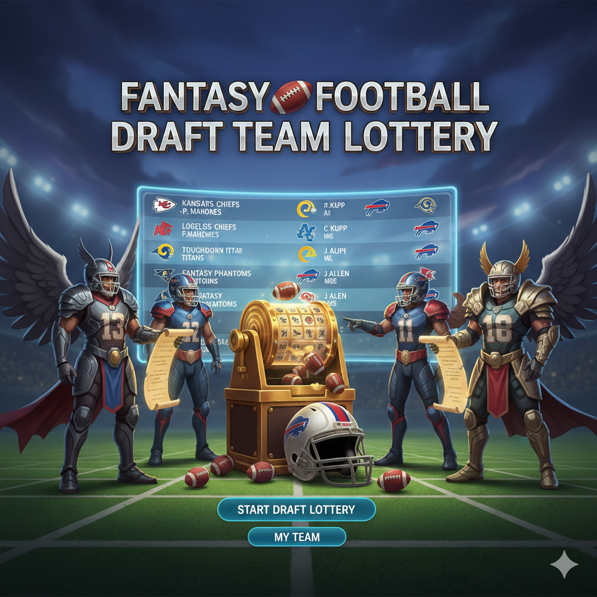

# Fantasy Football Draft Team Lottery



A sleek, animated draft lottery application for fantasy football leagues. Turn your draft order selection into an exciting event with countdown timers, weighted odds based on standings, and a visually stunning interface. Share your draft with league members so they can watch live!

## Features

- **Customizable Draft Setup**: Configure your draft name, total teams, and number of lottery participants
- **Weighted Lottery System**: Teams with worse standings get more lottery drawings, giving them better odds at earlier picks
- **Reserved Picks**: Support for leagues where top finishers keep their draft positions (e.g., first 2 picks reserved for playoff teams)
- **Configurable Countdown**: Adjust the suspense with customizable countdown timers (5-60 seconds per pick)
- **Live Odds Display**: Watch the lottery odds update in real-time as teams are selected
- **Team Customization**: Personalize each team with custom names, icons (30 emoji options), and colors (15 color options)
- **Preview Mode**: Preview your draft setup before committing to the lottery
- **Dramatic Finale**: The final two picks are revealed simultaneously for maximum suspense
- **Live Viewing**: Share a unique 6-character room code so league members can watch the draft in real-time

## How It Works

The lottery uses a weighted random selection based on end-of-season standings. Teams that finished lower in the standings receive more "drawings" in the lottery pool, increasing their chances of getting an earlier pick.

**Example**: In a 12-team league with 10 lottery teams:
- Picks 1-2 are reserved (for playoff teams or other purposes)
- The 10 lottery teams compete for picks 3-12
- A team that finished 10th place gets 10 drawings; a team that finished 1st gets 1 drawing
- Odds are calculated as: `(team's standing) / (total drawings) × 100%`

## Prerequisites

- [Node.js](https://nodejs.org/) (v18 or higher recommended)
- npm, yarn, or pnpm

## Installation

1. Clone the repository:
   ```bash
   git clone https://github.com/yourusername/fantasy-football-draft-picker.git
   cd fantasy-football-draft-picker
   ```

2. Install dependencies:
   ```bash
   npm install
   ```

## Running the App

### Development Mode

You need to run both the frontend development server and the WebSocket server:

**Terminal 1 - WebSocket Server:**
```bash
npm run server
```
The WebSocket server will start on `ws://localhost:3001`.

**Terminal 2 - Frontend:**
```bash
npm run dev
```
The app will be available at `http://localhost:5173` (or the next available port).

### Production Build

Build the app for production:

```bash
npm run build
```

Preview the production build locally:

```bash
npm run preview
```

For production deployment, you'll need to:
1. Deploy the WebSocket server (e.g., on a Node.js hosting platform)
2. Set the `VITE_WS_URL` environment variable to point to your WebSocket server
3. Deploy the built frontend to your hosting platform

## Usage

### Hosting a Draft (League Manager)

1. **Configure Your Draft**
   - Enter your draft/league name
   - Set the total number of teams in your league
   - Set how many teams will participate in the lottery
   - Adjust the countdown timer duration (default: 15 seconds)

2. **Set Up Teams**
   - Enter each team's name
   - Assign their end-of-season standing (determines lottery odds)
   - Choose an icon and color for each team

3. **Preview (Optional)**
   - Click "Preview Draft" to see how the draft board and odds will look
   - Make any adjustments before proceeding

4. **Start the Draft**
   - Click "Proceed to Draft"
   - A unique 6-character room code will be generated
   - Share this code or the full URL with your league members
   - Click "Begin Draft" when everyone has joined

5. **Re-run if Needed**
   - Use "Draft Again?" to re-run the lottery with the same settings
   - Use "Edit Draft Settings" to modify the configuration

### Watching a Draft (League Members)

1. **Join via URL**
   - Navigate to the shared draft URL (e.g., `http://yoursite.com/draft/ABC123`)
   - Or go to `/join` and enter the 6-character room code

2. **Watch Live**
   - The draft will sync in real-time with the host
   - You'll see the countdown, picks, and odds update live
   - A "Watching Live" badge indicates you're connected

## Environment Variables

| Variable | Description | Default |
|----------|-------------|---------|
| `VITE_WS_URL` | WebSocket server URL | `ws://localhost:3001` |
| `WS_PORT` | WebSocket server port (server-side) | `3001` |

## Tech Stack

- **React 19** - UI framework
- **TypeScript** - Type safety
- **Vite** - Build tool and dev server
- **Tailwind CSS 4** - Styling
- **Lucide React** - Icons
- **React Router 7** - Client-side routing
- **ws** - WebSocket server

## Project Structure

```
├── server/
│   └── index.js              # WebSocket server for live viewing
├── src/
│   ├── components/
│   │   ├── DraftSetup.tsx    # Draft configuration page
│   │   └── JoinDraft.tsx     # Join draft page for viewers
│   ├── contexts/
│   │   └── WebSocketContext.tsx  # WebSocket state management
│   ├── data/
│   │   └── Teams.tsx         # Default team data (reference)
│   ├── interfaces/
│   │   └── Team.tsx          # TypeScript interfaces
│   ├── App.tsx               # Main draft lottery logic
│   ├── App.css               # Global styles
│   └── main.tsx              # Application entry point
```

## License

MIT
